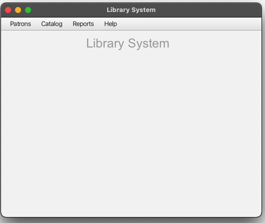
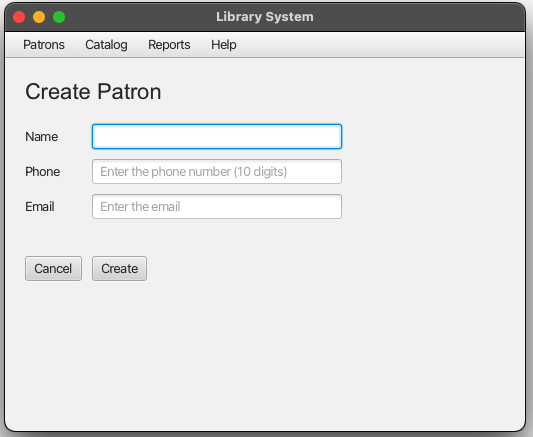
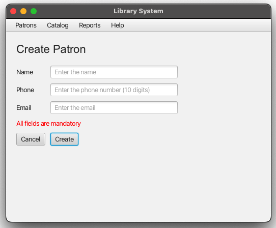
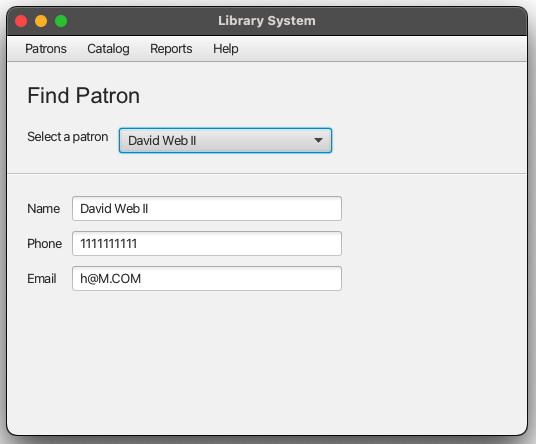
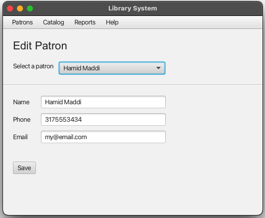
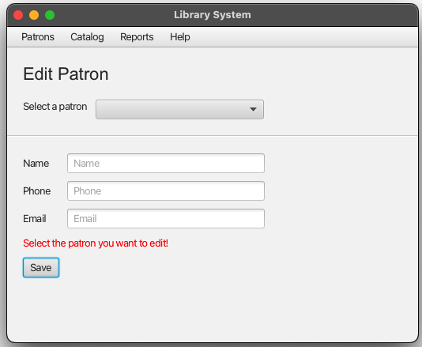
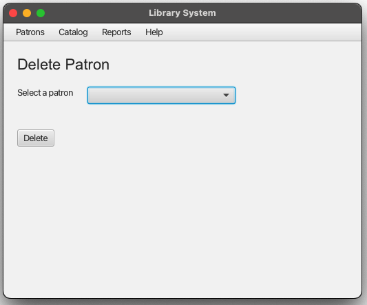
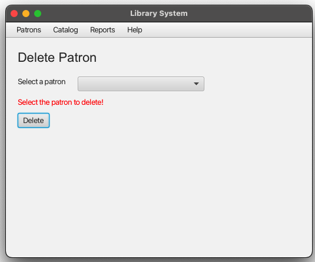

# Patrons

## Overview

This document provides information about how to create, edit, find or delete patrons

## Table of Contents

- [Landing Page](#landing-page)

- [Navigation Menu](#navigation-menu)

- [Create](#create=patron)

- [Find](#find-patron)

- [Edit](#edit-patron)

- [DELETE](#delete-patron)

### Landing Page

This is the first page the user will see.

### Navigation Menu

User will use the application navigation menu to perform actions.

### Create Patron

This page will allow users to create patrons.

The create patron page performs validation using the rules below
- all fields are mandatory
- email format validation (name@email.com)
- phone format validation (10 digits)

### Find Patron

This page allows users to find a patron and display their informaton.

### Edit Patron

This page will allow users to edit a paton.

The edit patron page performs validation using the rules below
- a patron has to be selected to perform a search
- all fields are mandatory
- email format validation (name@email.com)
- phone format validation (10 digits)

### Delete Patron

This page will allow users to delete a paton.

The edit patron page performs validation using the rules below
- a patron has to be selected inorder to perform a delete action

